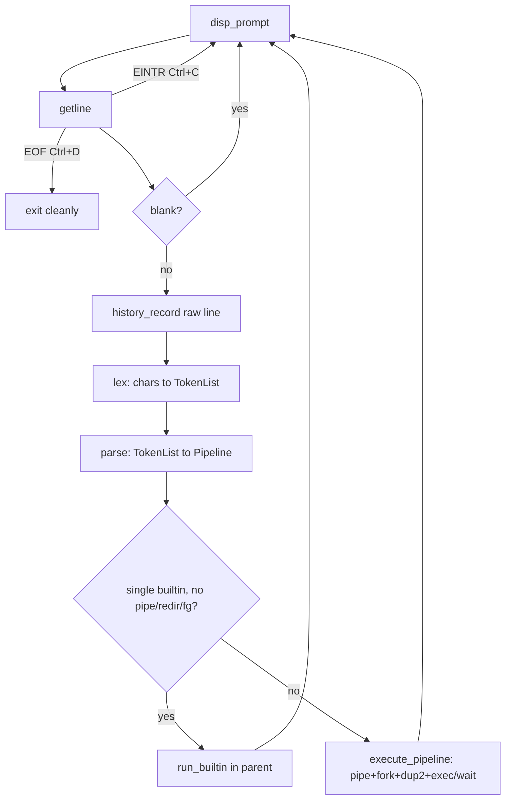
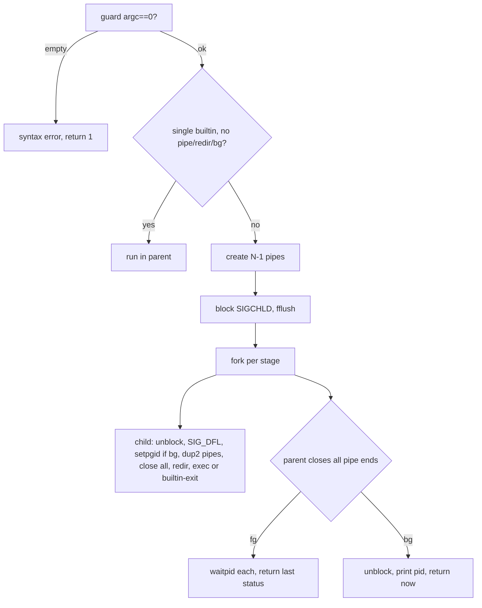

# radish — (comprehensive)

> Scope: everything an examiner can ask from `reference.md` + `reference2.txt` + your implementation (`main.c prompt.c lexer.c parser.c execute.c builtins.c signals.c`, headers, `makefile`, `README.md`). Pseudocode + flowcharts + OS theory + decisions + traps included.

---

## 0. One-paragraph mental model (say this first if asked "explain your project")

`radish` is an interactive Unix shell in C. Loop: **print prompt → read line (`getline`) → record history → lex (chars→tokens) → parse (tokens→`Pipeline` of `Command`s) → execute (`fork`/`execvp`/`pipe`/`dup2`/`waitpid`, or run builtin in-process)**. Builtins (`cd pwd echo history`) never use `exec`. External commands run in children. `|` connects children with kernel pipes. `<`/`>` rewire fd 0/1 with `open`+`dup2`. Trailing `&` = no wait + own process group. `SIGINT` never kills the shell; `SIGCHLD` reaps background jobs so no zombies. Code is split one concern per `.c`/`.h`; `makefile` builds `radish` via `all`, removes artifacts via `clean`.



---

## 1. OS theory brush-up (only what your shell touches)

| Concept                             | Minimum you must be able to say                                                                                                                                                                                                                                                                                                                                                                                                                                                                                                                                                                                                                                                       |
| ----------------------------------- | ------------------------------------------------------------------------------------------------------------------------------------------------------------------------------------------------------------------------------------------------------------------------------------------------------------------------------------------------------------------------------------------------------------------------------------------------------------------------------------------------------------------------------------------------------------------------------------------------------------------------------------------------------------------------------------- |
| Program vs process                  | Program = bytes on disk. Process = live instance: address space (text/data/heap/stack), fd table, PCB in kernel (pid, state, parent, exit status, signals pending/masked). Shell manages processes.                                                                                                                                                                                                                                                                                                                                                                                                                                                                                   |
| Kernel vs user mode + syscall       | Your code runs in user mode. `fork pipe dup2 execvp waitpid open close chdir getcwd setpgid sigaction sigprocmask` trap into the kernel. Library calls (`printf fopen strdup getline`) are user-space wrappers, some issuing syscalls underneath. getcwd can cache sometimes (and subsequently be run in user mode)                                                                                                                                                                                                                                                                                                                                                                   |
| `fork()`                            | Duplicates the calling process. Returns `0` to child, child-pid to parent, `-1` on failure. Address space logically copied (modern kernels: copy-on-write — pages shared read-only until either side writes). **Fd table is copied**: child inherits open fds and stdio buffers — hence the `fflush(stdout)` before `fork` and the mandatory close of unused pipe ends. Your `execute.c` forks **once per pipeline stage**.                                                                                                                                                                                                                                                           |
| `execvp(file, argv)`                | **Replaces** the calling process image with a new program; on success it never returns. `p` = search `PATH`, `v` = argv vector. `argv[0]` = command name, `argv` must be NULL-terminated (your parser guarantees this). Only returns `-1` on failure → your child prints `command not found` and `exit(127)` (bash convention).                                                                                                                                                                                                                                                                                                                                                       |
| `waitpid(pid, &st, opts)`           | Parent collects a child's exit status; this is what destroys the zombie. `0` flag = block. `WNOHANG` = poll. Macros: `WIFEXITED(st)` / `WEXITSTATUS(st)` / `WIFSIGNALED` / `WTERMSIG`. Your foreground path blocks per child; your `SIGCHLD` handler loops `waitpid(-1,…,WNOHANG)` to reap whatever finished.                                                                                                                                                                                                                                                                                                                                                                         |
| Zombie / orphan                     | Child exited but parent hasn't `wait`ed → **zombie** (PCB + exit code retained, no memory). Parent dies first → **orphan**, reparented to init/systemd which reaps it. Your shell avoids zombies two ways: explicit `waitpid` for foreground, `SIGCHLD` reaper for background + fork-failure cleanup.                                                                                                                                                                                                                                                                                                                                                                                 |
| Signals (async)                     | Kernel-to-process notification. Key ones here: `SIGINT`(2, Ctrl+C from terminal), `SIGCHLD`(17, child stopped/exited). Handler = function the kernel calls asynchronously — it can interrupt your code **anywhere**, so only **async-signal-safe** calls are legal inside (`write`, `waitpid`, `_exit`; **not** `printf/malloc/fprintf/strdup`). `sigaction` installs handlers reliably; legacy `signal()` has historic portability quirks (you use `sigaction` in parent, plain `signal(SIGINT,SIG_DFL)` once in the child where it is safe). `sigprocmask` blocks signals around critical sections. `SA_RESTART` makes interrupted slow syscalls resume instead of failing `EINTR`. |
| File descriptors + redirection      | Per-process table: `0`=stdin, `1`=stdout, `2`=stderr. `open()` returns lowest free fd. `dup2(old,new)` makes `new` point at `old`'s open file description (closing `new` first). Redirection = `open` file then `dup2(fd, 0/1)`. Must happen **in the child, after `fork`, before `exec`** so only the child is affected.                                                                                                                                                                                                                                                                                                                                                             |
| Pipe                                | `pipe(int f[2])` creates a kernel buffer with `f[0]`=read end, `f[1]`=write end — unidirectional. Data written to `f[1]` is read from `f[0]` FIFO. Both ends start open in the creating process and are inherited across `fork`. Rule: **every process closes the ends it doesn't use**, else readers never see EOF (a write end held open anywhere keeps the pipe "alive") and writers can block forever. Your N-command pipeline needs N−1 pipes.                                                                                                                                                                                                                                   |
| Foreground process group + terminal | The terminal sends `SIGINT` to every process in the **foreground process group**. Your background children call `setpgid(0,0)` (new group = own pid) so Ctrl+C structurally cannot reach them — no per-job signal bookkeeping needed.                                                                                                                                                                                                                                                                                                                                                                                                                                                 |
| `chdir`/`getcwd` are per-process    | CWD lives in each process's state. `chdir` in a child dies with the child — the classic reason `cd` **must** run in the shell process itself. This single fact justifies your "single-builtin fast path".                                                                                                                                                                                                                                                                                                                                                                                                                                                                             |

---

## 2. Architecture + data flow (files, structs, ownership)

Pipeline of modules, wired in `main.c`:

```
prompt → lexer → parser → execute → builtins → signals
```

Key types (`lexer.h`, `parser.h`):

```c
typedef enum { TOKEN_WORD, TOKEN_PIPE, TOKEN_REDIR_IN, TOKEN_REDIR_OUT,
               TOKEN_BACKGROUND, TOKEN_END } TokenType;
typedef struct { TokenType type; char *text; /* only for WORD */ } Token;
typedef struct { Token *tokens; int count; } TokenList;

typedef struct {
    char **argv;   /* NULL-terminated, fed straight to execvp */
    int argc;
    char *in_file;  /* NULL if no '<' */
    char *out_file; /* NULL if no '>' */
} Command;

typedef struct {
    Command *commands; int count;
    int background;    /* trailing '&' */
} Pipeline;
```

Ownership rule (examiner loves this): **lexer `strdup`s word text; parser `strdup`s again into `argv`/filenames; `main` frees both (`free_pipeline`, `free_token_list`) every iteration.** No leaks on the happy path; fixed-size history strings are `strdup`/`free`'d on eviction.

`main.c` REPL pseudocode:

```
init_shell_home(); install_signal_handlers(); history_init();
line = NULL; cap = 0;
loop:
    disp_prompt()
    n = getline(&line, &cap, stdin)
    if n < 0:
        if feof(stdin): print "\n"; break        # Ctrl+D
        if errno == EINTR: clearerr(stdin); continue  # Ctrl+C interrupted getline
        break
    strip trailing '\n'
    if empty or all spaces/tabs: continue
    history_record(line)          # raw line, BEFORE parse/execute
    tokens = lex(line)
    p = parse(&tokens)
    execute_pipeline(&p)
    free_pipeline(&p); free_token_list(&tokens)
free(line)
```

Why this order matters: history records even syntactically bad/failed commands (matches bash intuition); freeing per-iteration bounds memory; `clearerr` after `EINTR` prevents a stuck stdin error flag.


---

## 3. Lexer (`lexer.c` / `lexer.h`) — chars → tokens

**What "lexing" means:** the lowest language layer. It does not understand grammar; it just classifies character runs: words vs operators (`| < > &`) vs whitespace, honoring quotes. Output is a flat `TokenList` ending with a `TOKEN_END` sentinel.

Token kinds: `TOKEN_WORD` (only kind with `text`), `TOKEN_PIPE`, `TOKEN_REDIR_IN`, `TOKEN_REDIR_OUT`, `TOKEN_BACKGROUND`, `TOKEN_END`.

Pseudocode:

```
lex(input):
    list = malloc(cap=8); count = 0
    i = 0
    while input[i]:
        skip ' ' '\t' '\n'
        if '|': emit PIPE; i++
        elif '<': emit REDIR_IN; i++
        elif '>': emit REDIR_OUT; i++; if input[i]=='>': i++   # '>>' collapses to '>'
        elif '&': emit BACKGROUND; i++
        else:
            w = lex_word(input, &i)   # handles quotes, stops at ws/operator
            emit WORD(w); free(w)     # add_token strdup's it
    emit END                          # sentinel so parser never runs off the end
    return list

lex_word(input, &i):
    buf = malloc(64)
    while input[i]:
        c = input[i]
        if c == '\'': i++; copy literally until '\'' or EOS; skip closing '\''
        elif c == '"': i++; copy until '"', but '\"'→'"', '\\'→'\\'; skip closing '"'
        elif c in " \t\n|<>&": break
        else: append c; i++
    NUL-terminate; return buf  # caller frees

add_token / buf_grow: if full, capacity *= 2 (realloc). buf_grow needs needed*2+1.
free_token_list: free each text, free array, NULL it, count = 0.
```

Worked example — `grep "hello world" < in.txt | sort > out.txt &`:

```
WORD(grep) WORD(hello world) REDIR_IN WORD(in.txt) PIPE WORD(sort) REDIR_OUT WORD(out.txt) BACKGROUND END
```

Note `"hello world"` is **one** token — that is why `grep "foo bar" file` works.

Decisions and why:

- **Dynamic buffers, not `char[1024]`:** `buf_grow`/`add_token` double with `realloc`. Arbitrary-length words safe, no stack overflow. Failure path prints via `perror` and exits (can't usefully continue without memory).
- **Single-quote = fully literal** (spaces and `|<>` lose meaning inside). **Double-quote = literal except `\"` and `\\`.** Covers the demo case, stays in spec (spec says quotes need not be handled — yours are a deliberate extra).
- **Whitespace skipping** is what implements the `echo` spec ("multiple tabs/spaces → single space"): lexer drops extra separators; `builtin_echo` joins surviving words with one space.
- **`>>` → single `>`:** out of spec; collapsing avoids silently producing empty output files during demos. Trade-off stated openly: it truncates (`O_TRUNC`) instead of appending. True append would be `O_APPEND` — one-line change, deliberately not claimed.
- **`TOKEN_END` sentinel:** parser's `peek()` dereferences `tokens[pos]` unconditionally; without the sentinel it would read past the array → segfault. Cheap invariant, big safety win.
- Complexity `O(n)` single pass; memory `O(#tokens + chars)`.

Likely viva traps: "why not `strtok`?" — `strtok` cannot do quotes/operators/sentinel cleanly and mutates the input; a hand lexer gives exact operator tokens and preserves quoted spans. "What breaks without `free(word)` after `add_token`?" — leak per word (add_token already `strdup`'d). "Unterminated quote?" — treated as ending at EOS (lenient, no crash).

---

## 4. Parser (`parser.c` / `parser.h`) — tokens → `Pipeline`

**What "parsing" means:** impose grammar (structure) on the flat token stream and build a directly executable IR (`Pipeline`/`Command`).

Your grammar (also written at the top of both files):

```
pipeline : command ('|' command)* '&'?
command  : word+ redir*
redir    : '<' word | '>' word
```

Why this grammar (have this answer ready):

1. `|` binds loosest between whole commands; `('&')?` binds the **whole pipeline** (background is a pipeline property, `p.background`, not per-command) — matches shell semantics.
2. `redir` binds to its **command** (`in_file`/`out_file` fields), so `a < in | b > out` does the obviously right thing.
3. `word+` guarantees `argv[0]` exists for `execvp`/`is_builtin` on well-formed input; the executor's `argc==0` guard converts violations (`| foo`, bare `>`) into a clean `syntax error: empty command` instead of a NULL deref.
4. Left-to-right, single-pass recursive descent (`parse` → `parse_command` loop) is the simplest engine that also extends to N-stage pipes for the bonus marks. No parser generator needed.
5. `argv` is built **NULL-terminated** during parsing precisely so it can be handed to `execvp` with zero reshaping.

Pseudocode:

```
parse_command(tokens, &pos):
    argv = malloc(8); argc = 0; in_file = out_file = NULL
    while peek in {WORD, REDIR_IN, REDIR_OUT}:
        if WORD: grow argv if needed; argv[argc++] = strdup(consume().text)
        else:
            op = consume()                       # < or >
            if peek != WORD: print "expected filename after redirection"; break
            name = strdup(consume().text)
            if op == '<': free(in_file);  in_file  = name   # last-wins
            else:         free(out_file); out_file = name
    ensure room; argv[argc] = NULL
    return {argv, argc, in_file, out_file}

parse(tokens):
    p = malloc(4 commands); count = 0; background = 0; pos = 0
    p.commands[count++] = parse_command(...)     # first command unconditional
    while peek == PIPE:
        consume PIPE; grow if needed
        p.commands[count++] = parse_command(...)
    if peek == BACKGROUND: consume; background = 1
    return p

free_pipeline: for each command: free each argv[j], argv, in/out_file; then free commands[].
peek/advance: pos-indexed access; advance returns &tokens[(pos)++].
```

Implementation notes your examiner may probe:

- Capacity growth (`8` argv, `4` commands, doubling) = amortized `O(1)` append, no fixed limits on args/stages.
- Multiple same-type redirections (`cat < a < b`) are **last-wins + `free` old** — memory-safe and deterministic. Say so.
- Missing filename (`cat >`) prints `syntax error: expected filename after redirection` and stops that command — no overrun.
- The loop technically accepts `> out ls` (redir before words) even though the comment says `word+ redir*`; words still land in `argv` in order. If asked, call it "interleaving-tolerant, argv-preserving" — harmless superset of the stated grammar.
- `&` anywhere but the end is not part of the grammar: `sleep 3 & ls` parses as background pipeline + leftover `ls` tokens are ignored after `BACKGROUND` (END expected next). Known simplification; spec only requires trailing `&`.

Trace the earlier example through the parser:

```
commands[0] = {argv=[grep, hello world], in_file=in.txt,  out_file=NULL}
commands[1] = {argv=[sort],               in_file=NULL,   out_file=out.txt}
background = 1
```

---

## 5. Executor (`execute.c` / `execute.h`) — where `fork/pipe/dup2/wait` live

This is the most-marked file (foreground + background + redirection + pipes). Read this section twice.

### 5.1 Full pseudocode (matches your code order exactly)

```
apply_redirections(cmd):                       # CHILD ONLY
    if in_file:  fd = open(in_file, O_RDONLY); or die(exit 1)
                 dup2(fd, 0); close(fd)
    if out_file: fd = open(out_file, O_WRONLY|O_CREAT|O_TRUNC, 0644); or die
                 dup2(fd, 1); close(fd)

execute_pipeline(p):
    ncmds = p.count
    for each cmd: if argc == 0: "syntax error: empty command"; return 1   # NULL-deref guard

    if ncmds==1 and is_builtin(argv[0]) and !background
       and in_file==NULL and out_file==NULL:
        return run_builtin(&cmd)            # FAST PATH: stay in parent (cd needs this)

    pipes = ncmds-1 x pipe(); on pipe() failure: close opened ends; return 1
    pids[ncmds]
    fflush(stdout)                          # don't duplicate buffered output into children
    block SIGCHLD (sigprocmask), save old mask

    for i in 0..ncmds-1:
        pid = fork()
        if fork fails: close all pipes; waitpid(reap already-forked); restore mask; return 1
        if child:
            restore mask to old
            signal(SIGINT, SIG_DFL)         # child dies on Ctrl+C; shell doesn't
            if background: setpgid(0,0)     # own group → terminal SIGINT can't reach it
            if i > 0:         dup2(pipes[i-1][0], 0)   # stdin from previous pipe
            if i < ncmds-1:   dup2(pipes[i+1... wait: pipes[i][1], 1)  # stdout to next pipe
            close ALL pipe ends             # after dup2; else EOF hangs
            apply_redirections(cmd[i])      # files OVERRIDE pipe wiring
            if is_builtin(argv[0]): exit(run_builtin(...))  # builtins in pipes run in child
            execvp(argv[0], argv)
            "command not found" to stderr; exit(127)
        pids[i] = pid

    parent closes ALL pipe ends
    if foreground:
        for each child: waitpid(pids[i]); keep LAST child's status
        restore mask; return WEXITSTATUS(last) (or 1)
    else:
        restore mask immediately
        print "[background pid <last-pid>]"; return (status 0 path → returns 1 via tail logic)
```



### 5.2 Where and why each syscall (memorize this table)

| Call                              | Where                       | Why                                                                                                                                                                                            |
| --------------------------------- | --------------------------- | ---------------------------------------------------------------------------------------------------------------------------------------------------------------------------------------------- |
| `fork()`                          | per pipeline stage          | One child per command; parent keeps shell state. Failure path closes pipes, reaps already-forked children (no zombies), restores mask.                                                         |
| `execvp()`                        | child only                  | Replace child image with user command (`ls`, `grep`, `gcc`…). Never used for builtins (spec forbids it).                                                                                       |
| `pipe()`                          | parent, before forking      | N−1 kernel channels for N stages. Checked; partial cleanup on failure. VLA `pipes[ncmds-1>0?ncmds-1:1]` avoids zero-length array when `ncmds==1`.                                              |
| `dup2()`                          | child                       | Wire `stdin`←previous read end, `stdout`→next write end; then redirections overwrite. Order is the precedence rule.                                                                            |
| `close()` (pipe ends)             | child (all) + parent (all)  | **EOF correctness.** If any write end stays open in parent/child, downstream `read` never gets EOF → `cat \| wc` hangs. If any read end stays open, `SIGPIPE`/blocking surprises.              |
| `open()`                          | `apply_redirections`, child | `O_RDONLY` for `<`; `O_WRONLY\|O_CREAT\|O_TRUNC, 0644` for `>`. `perror` + `exit(1)` on failure (child must die, not fall through to exec).                                                    |
| `waitpid()`                       | parent foreground           | One blocking call per child; last stage's status is the pipeline status (bash-like).                                                                                                           |
| `sigprocmask(SIG_BLOCK, SIGCHLD)` | parent around fork+wait     | **Race guard:** stops the `SIGCHLD` reaper stealing a foreground child's status between `fork` and explicit `waitpid` (which would make `waitpid` fail `ECHILD`). Restored on every exit path. |
| `setpgid(0,0)`                    | background child            | New process group → Ctrl+C (sent to fg group only) skips it.                                                                                                                                   |
| `signal(SIGINT, SIG_DFL)`         | child                       | Reset to default so foreground children die on Ctrl+C while the shell survives.                                                                                                                |
| `fflush(stdout)`                  | parent pre-fork             | Children inherit the stdio buffer copy; unflushed bytes would print twice / corrupt pipe data.                                                                                                 |
| `WIFEXITED/WEXITSTATUS`           | return path                 | Unpack status integer into exit code.                                                                                                                                                          |

### 5.3 Three answers examiners always want

1. **"Why does `cd` need the fast path?"** `chdir()` mutates the calling process's CWD. In a child that mutation evaporates at `exit`. Only the parent path persists. Same logic would apply to any stateful builtin (`export`, `unset`, `umask`) — stateless ones (`pwd`, `echo`, `history`) would technically survive a fork, but yours uniformly takes the fast path for the single-command case for consistency.
2. **"Why do builtins still work inside pipelines?"** They run in the child and `exit(code)`. `echo hi | wc -c` forks both sides; the left child runs the builtin then exits; `wc` reads EOF normally. State change is intentionally discarded there (POSIX shells do the same).
3. **"Redirection + pipe together?"** `grep foo < in.txt | sort > out.txt`: stage 0's stdin is the file (redir overrides nothing on that side since no incoming pipe... actually both apply: `dup2` pipe first, then file wins), stage 1's stdout is the file. Middle stages use pure pipes. Redirection always wins because it runs after pipe wiring.

---

## 6. Builtins (`builtins.c` / `builtins.h`) — no `exec`, by spec

Contract: `is_builtin(name)` = `cd/pwd/echo/history` via `strcmp`; `run_builtin(cmd)` dispatches and returns an exit status. Adding a builtin = extend both + write one `static` function (see §9).

### `cd` (7 marks — know every branch)

```
builtin_cd(cmd):
    if argc > 2: "too many arguments"; return 1
    old = getcwd() or die
    target =
        argc==1      → shell home
        argv[1]=="~" → shell home
        argv[1]==".."→ ".."            # kernel resolves; works from anywhere
        argv[1]=="-" → prev_dir or "no previous directory." if never set; set dash flag
        else         → argv[1] verbatim (absolute or relative)
    if chdir(target) fails: "cd: <target>: <strerror(errno)>"; return 1
    prev_dir = old; has_prev = 1       # strncpy + NUL clamp
    if dash: print new getcwd()        # spec: cd - echoes destination
    return 0
```

State: `prev_dir[1024]` + `has_prev_dir`. Updated **after** successful `chdir` from the pre-change CWD — so `cd -` toggles. First-use `cd -` errors. `argc>2` errors. `strerror(errno)` distinguishes "no such file" vs "permission denied" vs "not a directory" — say that.

### `pwd` / `echo`

```
pwd:  buf=getcwd() or die; print buf; return 0/1
echo: for i in 1..argc-1: print argv[i], single space between; print '\n'
```

`echo` spec nuance ("collapse tabs/spaces") is satisfied **jointly**: lexer already split on runs of whitespace (including inside-tab handling) and `echo` re-joins with exactly one space. No escape/quote/`$VAR` handling — explicitly out of spec; quotes were consumed by the lexer, so `echo "a  b"` prints `a  b` with inner spacing preserved (one token).

### `history` (8 marks — ring + persistence + dedup)

Params: `HISTORY_MAX 20`, `HISTORY_SHOW 10`, file `.radish_history` under the shell home (`shell_home/HISTORY_FILENAME` via `snprintf`).

```
history_init():                       # once, at startup
    f = fopen(path, "r"); if missing: return (first run, not an error)
    for each line: strip '\n'; skip empties
        if count<20: buf[count++] = strdup(line)
        else: free(buf[0]); memmove(buf, buf+1, 19 ptrs); buf[19] = strdup(line)
    fclose

history_record(line):                 # every raw line, before lex/parse
    if NULL/empty: return
    copy to trimmed[4096] (strncpy + NUL); strip trailing ' '/'\t'; if empty: return
    if trimmed == "history": return             # never store self
    if count>0 and buf[count-1]==trimmed: return # consecutive-dedup only
    append-or-evict same as init
    history_save()                              # rewrite whole file (20 lines max — cheap)

builtin_history():
    start = count>10 ? count-10 : 0
    for i in start..count-1: printf("%5d  %s\n", i+1, buf[i])   # 1-based, bash-style
```

Say: ring = fixed array + `memmove` shift on overflow (`O(20)` = trivially cheap; a head-index ring would avoid moves but complicate the 1-based display numbering — deliberate simplicity). Persistence = full rewrite per command (crash-safe enough at this scale, survives sessions). Dedup is **consecutive only** (`ls, ls` → one; `ls, pwd, ls` → all three). `history` excluded even with trailing spaces because the trim happens first.

---

## 7. Prompt (`prompt.c` / `prompt.h`, `colors.h`)

```
shell_home[1024]; init_home flag
init_shell_home(): getcwd(shell_home) or fallback "/"; init_home = 1
disp_prompt():
    username = getpwuid(getuid())->pw_name or "unknown"
    hostname = gethostname() or "unknown-host"
    cwd      = getcwd() or "?"
    if !init_home: init_shell_home()
    if cwd starts with shell_home AND next char is '/' or NUL:
         dir = "~" + (cwd + strlen(shell_home))     # prefix replace
    else dir = cwd
    printf("<USER..@HOST..:DIR..> "); fflush(stdout)
```

Syscalls: `getpwuid(getuid())`, `gethostname`, `getcwd`. Nothing hard-coded (spec's 5 marks). `~` = **launch directory**, intentionally not `$HOME` (README states this; if launched from `/tmp`, `~` is `/tmp`). Boundary check (`'/'` or `'\0'`) stops `/home/u2` matching home `/home/u`. `fflush` guarantees prompt visibility before blocking `getline` (stdio vs stderr interleaving). Colors are isolated macros in `colors.h` (`\033[…m`); errors reuse `COLOR_ERROR`. Removing color = edit one header.

---

## 8. Signals (`signals.c` / `signals.h`) — in depth

Your two handlers + installer:

```c
sigint_handler:  write(STDOUT_FILENO, "\n", 1);          // NOT printf (unsafe in handler)
sigchld_handler: saved = errno;
                 while ((pid = waitpid(-1, &status, WNOHANG)) > 0) {}  // reap ALL finished
                 errno = saved;
install: sigaction(SIGINT,  handler, mask={}, flags=0);
         sigaction(SIGCHLD, handler, mask={}, flags=SA_RESTART);
```

Pseudocode for behavior:

```
Ctrl+C pressed:
    kernel sends SIGINT to foreground process GROUP (shell + fg children share it)
    shell:   handler runs → writes '\n' → returns → getline fails EINTR → clearerr → fresh prompt
    fg child: has SIG_DFL → dies
    bg child: different group (setpgid) → never receives it → unaffected   # structural, not bookkeeping

Background child exits:
    kernel sends SIGCHLD to shell
    handler loops waitpid(WNOHANG) until none left → no zombies
    (coalescing-safe: multiple exits → one signal → loop reaps all)

Ctrl+D on empty line:
    NOT a signal. Terminal sends EOF → getline returns -1 with feof → print '\n' → break → free(line) → exit 0
```

Five details that earn marks:

1. **`write`, not `printf`, in handler** — `printf` touches global stdio locks/buffers; if the signal interrupts another stdio call, re-entering corrupts them. `write(2)` is async-signal-safe.
2. **`errno` save/restore** in `SIGCHLD` — `waitpid` mutates `errno`; without restore, mainline error paths misreport.
3. **`WNOHANG` loop** — signals coalesce; one `SIGCHLD` may mean several dead children. `while (>0)` reaps all; `0` = none ready, `-1` = error/no children.
4. **`SA_RESTART` on `SIGCHLD`, absent on `SIGINT`** — background deaths must not break `getline` with `EINTR`; Ctrl+C **must** break it so the shell redisplays. Your `main` handles both: `EINTR→continue`, `feof→exit`. This asymmetry is deliberate — say it.
5. **Race guard in executor** — `sigprocmask(BLOCK, SIGCHLD)` across fork→waitpid; handler uses `waitpid(-1)` which would otherwise steal the foreground status first (`waitpid` in parent then fails `ECHILD`). Mask restored on all four exit paths (fg done, bg done, fork fail, pipe fail returns before blocking... note pipe-fail path returns before blocking, correctly).

Honest limitation (say it before they find it): only the **child** calls `setpgid`; the parent never does. A background child that exits between `fork` and its own `setpgid` is briefly in the fg group. Fully race-free code would `setpgid` from both sides. Fine at this scale, worth naming.

---

## 9. "Implement another builtin" (guaranteed question)

Recipe (concrete — walk them through an example like `exit [code]` or `jobs`):

1. `builtins.h`: no change needed unless new history/state helpers.
2. `builtins.c`: add `"exit"` to `is_builtin`; add branch in `run_builtin`; write `static int builtin_exit(Command*)` using only libc/syscalls that fit (no `exec*` — spec bans it for builtins).
3. Decide **parent vs child**: stateful (`cd`, `export`, `umask`, `exit`) must take the single-command fast path (already automatic: `is_builtin` + no pipe/redir/fg → parent). Pure filters (`echo`, a hypothetical `toupper`) also work in children inside pipelines.
4. Redirection caveat: your fast path **skips** builtins when `<`/`>` present (falls into fork path, builtin runs in child, output goes to file but `cd`-like state is lost). If asked "make `echo hi > f` not fork", answer: extend fast path to allow `>` for stateless builtins by applying redirection in-parent — but then you must save/restore fds (`dup`/`dup2` dance). Deliberately not done.
5. Errors: red errors to stderr, return nonzero; `strerror(errno)` for syscalls.

Sketch:

```c
static int builtin_exit(Command *c) {
    int code = 0;
    if (c->argc > 2) { fprintf(stderr, "radish: exit: too many arguments\n"); return 1; }
    if (c->argc == 2) { char *e; long v = strtol(c->argv[1], &e, 10);
                        if (*e) { fprintf(stderr, "radish: exit: numeric argument required\n"); return 2; }
                        code = (int)(v & 0xFF); }
    exit(code);   // parent path: whole shell exits; in a pipeline child: only that stage exits
}
```

---

## 10. Modularity + headers (15-mark spec)

| File | Owns | Talks to |
|---|---|---|
| `prompt.h/.c` | home init, prompt | `colors.h`, libc |
| `lexer.h/.c` | `TokenList`, `lex`, `free_token_list` | nothing project-internal |
| `parser.h/.c` | `Command`/`Pipeline`, `parse`, `free_pipeline` | `lexer.h` |
| `execute.h/.c` | `execute_pipeline` | `parser.h`, `builtins.h` |
| `builtins.h/.c` | builtins + history | `parser.h` (`Command`), `prompt.h` (home extern) |
| `signals.h/.c` | `install_signal_handlers` | kernel only |
| `colors.h` | ANSI macros, header-only | — |
| `main.c` | REPL wiring only | all of the above |

Why: one reason to change per file; headers are contracts (include guards `#ifndef X_H` prevent double inclusion; `extern char shell_home[1024]` shares exactly one definition); acyclic includes (nothing includes `execute.h` except `main.c`); each unit is testable in isolation. Marking-spec mapping: `cd.c/display.c/execute.c`-style split ✓.

---

## 11. Makefile (be able to narrate every line)

```make
CC      = gcc
CFLAGS  = -Wall -Wextra -std=c11 -g
TARGET  = radish
SRCS    = main.c prompt.c lexer.c parser.c execute.c builtins.c signals.c
OBJS    = $(SRCS:.c=.o)

all: $(TARGET)

$(TARGET): $(OBJS)
	$(CC) $(CFLAGS) -o $@ $^

%.o: %.c
	$(CC) $(CFLAGS) -c $< -o $@

clean:
	rm -f $(OBJS) $(TARGET)
```

Line-by-line: `CC` compiler; `CFLAGS` = all warnings + extra + C11 standard + debug symbols (`-g` → gdb-able, also why stray `.o` files exist in your dir); `TARGET` output binary; `SRCS` all translation units; `OBJS` substitution (`main.c→main.o`…). `all` (default target, first = runs on bare `make`) needs `$(TARGET)`; link rule combines objects (`$@`=target `radish`, `$^`=all prereqs); pattern rule compiles each `.c`→`.o` (`$<`=first prereq); `clean` deletes artifacts. **Recipes must start with TAB.** Rebuild logic: `make` compares mtimes — recompiles only stale `.o`s, relinks if any changed. Manual equivalent is in `README.md`. `make clean` required by spec.

---

## 12. Syscall / library catalogue (where each is used)

| Call | Header | Kind | Used in | Purpose |
|---|---|---|---|---|
| `getcwd` | `unistd.h` | syscall wrap | prompt, `pwd`, `cd` | read CWD; NULL-checked everywhere |
| `chdir` | `unistd.h` | syscall | `builtin_cd` | change shell CWD; `strerror(errno)` on fail |
| `getpwuid/getuid` | `pwd.h`/`unistd.h` | libc+sys | prompt | username, `unknown` fallback |
| `gethostname` | `unistd.h` | syscall | prompt | host, `unknown-host` fallback |
| `fork` | `unistd.h` | syscall | executor | per pipeline stage |
| `execvp` | `unistd.h` | syscall | executor child | run external; `127` on fail |
| `waitpid` | `sys/wait.h` | syscall | executor + SIGCHLD handler | fg reap / bg reap (`WNOHANG` loop) |
| `pipe` | `unistd.h` | syscall | executor | N−1 channels |
| `dup2` | `unistd.h` | syscall | executor child | wire pipes + redirections |
| `open/close` | `fcntl.h`/`unistd.h` | syscall | redirections, pipe cleanup | `O_RDONLY` / `O_WRONLY\|O_CREAT\|O_TRUNC,0644` |
| `setpgid` | `unistd.h` | syscall | bg child | isolate from terminal SIGINT |
| `sigaction` | `signal.h` | syscall | signals | install both handlers |
| `sigprocmask/sigemptyset/sigaddset` | `signal.h` | syscall | executor | block SIGCHLD across fork→wait |
| `signal` | `signal.h` | libc (legacy) | child only | `SIG_DFL` reset — safe there |
| `getline` | `stdio.h` | libc (mallocs) | main | arbitrary-length input; `EINTR`/`feof` paths |
| `fopen/fgets/fprintf/fclose` | `stdio.h` | libc | history | persist ring file |
| `strdup/strncpy/strncmp/strcmp/strlen/memmove/snprintf` | `string.h`/`stdio.h` | libc | everywhere | ownership-safe string handling; `memmove` (overlap-safe) for ring shift; `snprintf` (bounded) for paths |

---

## 13. Decisions + extras (defend each in one line)

From `README.md`, all deliberate: color-isolated `colors.h`; heap-doubled lexer buffers (no stack cap); quote handling (single-literal, double + `\"` `\\`); `>>` collapses to `>` (predictable truncation over silent wrong output); `%5d` 1-based history numbering (bash convention); trailing-whitespace trim before history dedup/store (so `ls   `≡`ls`, `history   ` still excluded); single-builtin fast path (makes `cd` persist); SIGCHLD mask guard (no `ECHILD` theft); `setpgid` isolation (Ctrl+C skips bg structurally); `fflush` pre-fork (no buffer duplication); `pipe`/`fork` failure paths close + reap + restore (no hang/zombie/leak); `argc==0` guard (operator-only input → message, not segfault); `0644` output mode; `127` not-found code; `prev_dir` only committed after successful `chdir`.

---

## 14. Limitations (state openly; each has a reason)

`>>` truncates (`O_TRUNC`; append = `O_APPEND`, one flag away, out of scope). No `;`, `&&`/`||`, subshells, `$VAR`, `echo` escapes (all out of spec). No `jobs/fg/bg` (bg reaped silently). Path buffers 1024 (`shell_home`, `prev_dir`, prompt `cwd`); history line buffer 4096 pre-trim (longer commands truncated for storage, execution unaffected — lexing itself is dynamic). Last-wins on repeated same-direction redirection. `&` only meaningful trailing. Parent-side `setpgid` race (see §8) accepted.

---

## 15. Rapid-fire viva bank (one-line answers)

- Shell? Loop reading commands and managing processes to run them.
- Why `fork` before `exec`? `fork` gives a disposable process; `exec` replaces only that child, shell survives.
- Parent vs child duties? Child wires fds + `exec`; parent closes pipes + `wait`s (fg) or returns (bg).
- Why `wait`? Collect status, kill zombie.
- Zombie vs orphan? Unreaped-exited vs parent-died; yours prevents both paths.
- Pipe EOF rule? All write ends closed → reader gets 0 bytes (EOF); one leaked writer → hang.
- `dup2(p[0],0)` meaning? stdin now reads the pipe.
- Why close after `dup2`? The dup'd number suffices; originals would leak + block EOF.
- Redirection order? Pipes first, files second → files win.
- `O_TRUNC` vs `O_APPEND`? Truncate vs append; yours truncates.
- `0644`? `rw-r--r--`.
- Why builtin fast path? `chdir` is per-process; child-side `cd` evaporates.
- Why no `exec` in builtins? Spec bans; also pointless — logic is local syscalls.
- Lexer vs parser? Classify chars vs build structure.
- Why grammar shaped so? `|` between commands, `&` whole-pipeline, redir per-command, `word+` feeds `execvp`.
- Sentinel `TOKEN_END`? Parser `peek` never overruns.
- `argv` NULL why? `execvp` contract.
- `fflush` before fork? Don't clone buffered bytes into every child.
- SIGCHLD mask why? Handler's `waitpid(-1)` would steal fg status → `ECHILD`.
- `SA_RESTART` asymmetry? Bg deaths musn't break input; Ctrl+C must.
- `write` in handler? Only async-signal-safe calls; `printf` corrupts stdio.
- `setpgid` effect? Bg leaves fg group; terminal SIGINT skips it.
- Ctrl+D? EOF on stdin, not a signal; `feof` → clean exit.
- `cd -` state? `prev_dir` + flag, committed post-success, echoed.
- History numbers? Last 20 stored, last 10 shown, file-backed, consecutive-dedup, `history` excluded.
- `memmove` not `memcpy`? Overlapping shift; `memcpy` is UB there.
- `snprintf` not `sprintf`? Bounded, no overflow.
- Makefile `$@ $< $^`? Target, first prereq, all prereqs.
- `-Wall -Wextra -std=c11 -g`? Warnings on, C11, debug info.
- `.o` files in repo? Build artifacts; `make clean` removes.
- `exit(127)`? Bash's command-not-found code.
- `strerror(errno)`? Human reason for failed syscall.
- Add `export`? `is_builtin` + `run_builtin` + `setenv()` in parent path.
- `echo hi > f` forks — why accepted? Fast path excludes redir; parent-side redir needs fd save/restore dance, skipped deliberately.

---

## 16. Demo script (if given the terminal)

```
./radish
pwd; echo hello   world		with   spaces
cd /tmp; pwd; cd -; cd; cd ..; cd nodir; cd a b
history; history          # second one proves trim+self-exclusion
sleep 2 &                 # immediate prompt; Ctrl+C here kills nothing of yours
ls | grep radish
ls | grep radish | wc -l  # bonus multi-pipe
grep radish < makefile > out.txt; cat out.txt
| foo                     # clean syntax error, no crash
Ctrl+C at prompt          # newline + fresh prompt, shell alive
Ctrl+D                    # clean exit
cat .radish_history       # persistence proof
```

*Author: Ritvik Uppuganti — 2025122012. Spec PDFs + `reference.md`/`reference2.txt` drive requirements; this file is the viva narrative over them.*
